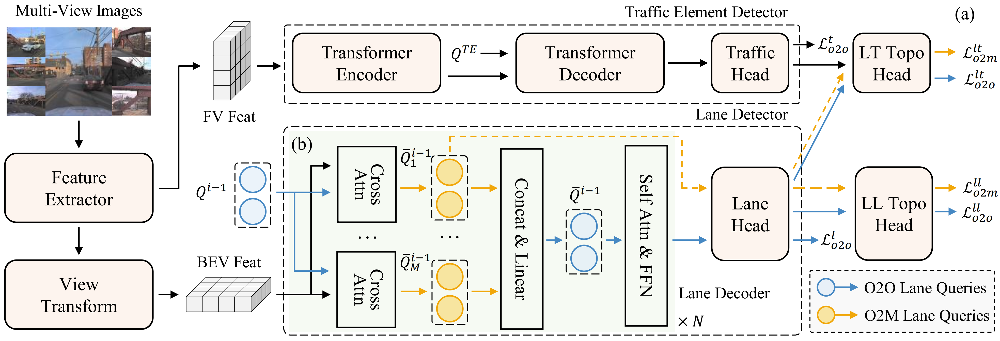
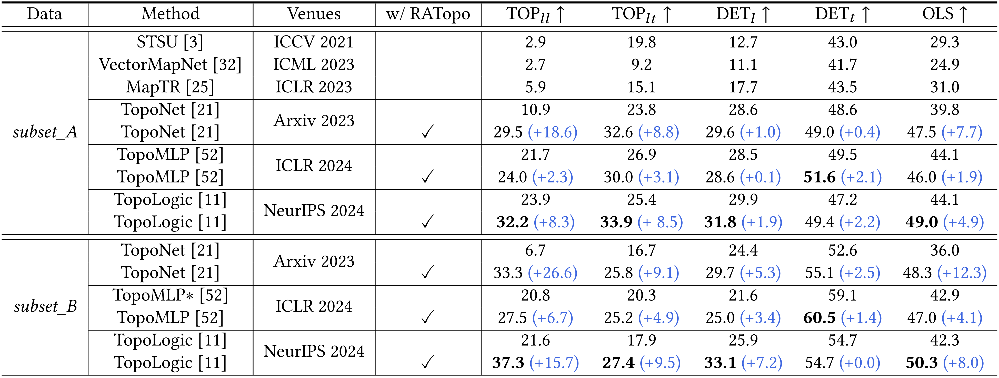

# RATopo
This repo is the official PyTorch implementation for paper: [RATopo: Improving Lane Topology Reasoning via Redundancy Assignment](https://arxiv.org/pdf/2508.15272). Accepted by **ACM MM 2025**.



Lane topology reasoning plays a critical role in autonomous driving by modeling the connections among lanes and the topological relationships between lanes and traffic elements. Most existing methods adopt a first-detect-then-reason paradigm, where topological relationships are supervised based on the one-to-one assignment results obtained during the detection stage. This supervision strategy results in suboptimal topology reasoning performance due to the limited range of valid supervision. In this paper, we propose **RATopo**, a **R**edundancy **A**ssignment strategy for lane **Topo**logy reasoning that enables quantity-rich and geometry-diverse topology supervision. Specifically, we restructure the Transformer decoder by swapping the cross-attention and self-attention layers. This allows redundant lane predictions to be retained before suppression, enabling effective one-to-many assignment. We also instantiate multiple parallel cross-attention blocks with independent parameters, which further enhances the diversity of detected lanes. Extensive experiments on OpenLane-V2 demonstrate that our RATopo strategy is model-agnostic and can be seamlessly integrated into existing topology reasoning frameworks, consistently improving both lane-lane and lane-traffic topology performance.

## Table of Contents
- [News](#News)
- [Installation](#Installation)
- [Prepare Dataset](#Prepare-Dataset)
- [Train and Evaluate](#Train-and-Evaluate)
- [Main Results](#Main-Results)
- [Citation](#Citation)
- [Acknowledgement](#Acknowledgement)

## News
- [2026/01/13] The code and models are released.
- [2025/08/21] The paper is released on arXiv.

## Installation

Our code is developed with **Python 3.8.10** and **CUDA 11.8**. The full list of required dependencies can be found in `requirements.txt`.

## Prepare Dataset

For the OpenLane-V2 dataset, please follow the instructions in
[README.md](https://github.com/OpenDriveLab/OpenLane-V2/blob/master/data/README.md) to download and preprocess the data. After preprocessing, the dataset should be organized as follows:
```
data
└── OpenLane-V2
    ├── data_dict_subset_A.json
    ├── data_dict_subset_A_test.pkl
    ├── data_dict_subset_A_train.pkl
    ├── data_dict_subset_A_val.pkl
    ├── data_dict_subset_B.json
    ├── data_dict_subset_B_test.pkl
    ├── data_dict_subset_B_train.pkl
    ├── data_dict_subset_B_val.pkl
    ├── preprocess.py
    ├── test
    ├── train
    └── val
```

## Train and Evaluate

### Prepare pretrained models.

```shell
mkdir ckpts
cd ckpts 
wget https://download.pytorch.org/models/resnet50-19c8e357.pth
```

### Train RATopo with 8 GPUs.
```shell
bash tools/dist_train.sh ratopo_subset_a 8      # subset_A
bash tools/dist_train.sh ratopo_subset_b 8      # subset_B
```

### Evaluate RATopo with 8 GPUs.
The pretrained checkpoints are available at [subset_A](https://drive.google.com/file/d/1kc7p_cvAj-qT7fbtc1xeh8gq4PfUGyiK/view?usp=sharing) and [subset_B](https://drive.google.com/file/d/1J5cjptgvbSKDQ42Uo1V7ACQ_lIdOmirO/view?usp=sharing).

```shell
bash tools/dist_test.sh ratopo_subset_a 8       # subset_A
bash tools/dist_test.sh ratopo_subset_b 8       # subset_B 
```

## Main Results



## Citation
If you find this repo useful for your research, please consider citing it using the following BibTeX entry.

```
@inproceedings{li2025ratopo,
  title={RATopo: Improving Lane Topology Reasoning via Redundancy Assignment},
  author={Li, Han and Huang, Shaofei and Xu, Longfei and Gao, Yulu and Mu, Beipeng and Liu, Si},
  booktitle={Proceedings of the 33rd ACM International Conference on Multimedia},
  pages={777--786},
  year={2025}
}
```

## Acknowledgement
We thank the authors that open the following projects.
- [OpenLane-v2](https://github.com/OpenDriveLab/OpenLane-V2)
- [TopoNet](https://github.com/OpenDriveLab/TopoNet)
- [TopoMLP](https://github.com/wudongming97/TopoMLP)
- [TopoLogic](https://github.com/Franpin/TopoLogic)
- [Group DETR](https://github.com/Atten4Vis/GroupDETR)
- [MS-DETR](https://github.com/Atten4Vis/MS-DETR)
