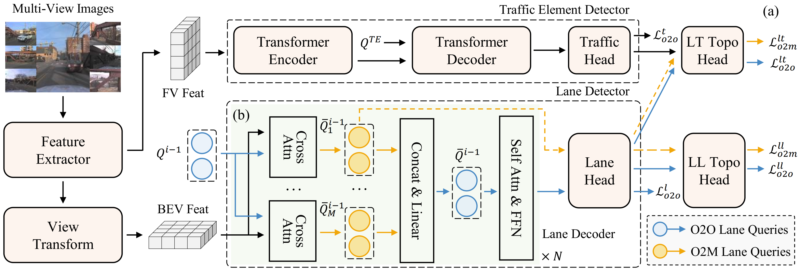
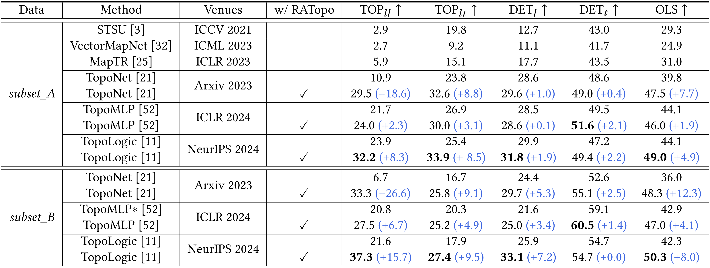

<div align="center">

<h1>RATopo: Improving Lane Topology Reasoning via Redundancy Assignment</h1>

<div>
    <a href='https://scholar.google.com/citations?user=o31I6xUAAAAJ' target='_blank'>Han Li</a><sup>1,2</sup>&emsp;
    <a href='https://scholar.google.com/citations?user=hVbSuo0AAAAJ' target='_blank'>Shaofei Huang</a><sup>3</sup>&emsp;
    <a href='https://github.com/silencexw15' target='_blank'>Longfei Xu</a><sup>1</sup>&emsp;
    <a href='https://scholar.google.com/citations?user=s3u33VAAAAAJ' target='_blank'>Yulu Gao</a><sup>1</sup>&emsp;
    <a href='https://scholar.google.com/citations?user=GiHhDhkAAAAJ' target='_blank'>Beipeng Mu</a><sup>4</sup>&emsp;
    <a href='https://scholar.google.com/citations?user=-QtVtNEAAAAJ' target='_blank'>Si Liu</a><sup>1</sup>
</div>
<div>
    <sup>1</sup>Beihang University&emsp;
    <sup>2</sup>Zhongguancun Academy&emsp;
    <sup>3</sup>University of Macau&emsp;
    <sup>4</sup>Meituan
</div>

<div>
    <strong>ACM MM 2025</strong>
</div>

<div>
    <h4 align="center">
        <a href="https://arxiv.org/abs/2508.15272" target='_blank'>
        
        </a>
        <a href="#citation">
        
        </a>
        <a href="LICENSE">
        
        </a>
    </h4>
</div>

<strong>We propose a redundancy assignment strategy for lane topology reasoning that enables quantity-rich and geometry-diverse topology supervision. We also instantiate multiple parallel cross-attention blocks with independent parameters, which further enhances the diversity of detected lanes.</strong>

<div style="text-align:center">

</div>

---

</div>

## News

* **[2026/01/13]** The code and models are released.
* **[2025/08/21]** The paper is released on arXiv.

## Highlights

* **Limitation of existing lane topology reasoning methods**. We identify the critical limitation of sparse valid topology supervision in existing lane topology reasoning methods, which stems from the inherent conflict between one-to-one label assignment in DETR-style lane detectors and the geometric ambiguity of lane structure representations.
* **Model-agnostic redundancy assignment strategy**. We propose RATopo, a model-agnostic redundancy assignment strategy that breaks the one-to-one assignment bottleneck by restructuring the Transformer decoder and introducing parallel cross-attention, enabling dense and geometrically diverse valid topology supervision.
* **Consistent improvements on various topology reasoning methods**. Extensive experiment results on OpenLane-V2 show that our RATopo obtains consistent improvements on various topology reasoning methods, demonstrating its effectiveness and generality.

## Usage

### Installation

Our code is developed with **Python 3.8.10** and **CUDA 11.8**. The full list of required dependencies can be found in `requirements.txt`.

### Prepare Dataset

For the OpenLane-V2 dataset, please follow the instructions in
[README.md](https://github.com/OpenDriveLab/OpenLane-V2/blob/master/data/README.md) to download and preprocess the data. After preprocessing, the dataset should be organized as follows:
```
data
└── OpenLane-V2
    ├── data_dict_subset_A.json
    ├── data_dict_subset_A_test.pkl
    ├── data_dict_subset_A_train.pkl
    ├── data_dict_subset_A_val.pkl
    ├── data_dict_subset_B.json
    ├── data_dict_subset_B_test.pkl
    ├── data_dict_subset_B_train.pkl
    ├── data_dict_subset_B_val.pkl
    ├── preprocess.py
    ├── test
    ├── train
    └── val
```

### Train and Evaluate

#### Prepare pretrained models.

```shell
mkdir ckpts
cd ckpts 
wget https://download.pytorch.org/models/resnet50-19c8e357.pth
```

#### Train RATopo with 8 GPUs.
```shell
bash tools/dist_train.sh ratopo_subset_a 8      # subset_A
bash tools/dist_train.sh ratopo_subset_b 8      # subset_B
```

#### Evaluate RATopo with 8 GPUs.
The pretrained checkpoints are available at [subset_A](https://drive.google.com/file/d/1kc7p_cvAj-qT7fbtc1xeh8gq4PfUGyiK/view?usp=sharing) and [subset_B](https://drive.google.com/file/d/1J5cjptgvbSKDQ42Uo1V7ACQ_lIdOmirO/view?usp=sharing).

```shell
bash tools/dist_test.sh ratopo_subset_a 8       # subset_A
bash tools/dist_test.sh ratopo_subset_b 8       # subset_B 
```

## Main Results



## Citation
If you find this repo useful for your research, please consider citing it using the following BibTeX entry.

```
@inproceedings{li2025ratopo,
  title={RATopo: Improving Lane Topology Reasoning via Redundancy Assignment},
  author={Li, Han and Huang, Shaofei and Xu, Longfei and Gao, Yulu and Mu, Beipeng and Liu, Si},
  booktitle={Proceedings of the 33rd ACM International Conference on Multimedia},
  pages={777--786},
  year={2025}
}
```

## License

This project is licensed under the Apache-2.0 License. See [LICENSE](./LICENSE) for more information.

## Acknowledgement

We thank the authors that open the following projects.
- [OpenLane-v2](https://github.com/OpenDriveLab/OpenLane-V2)
- [TopoNet](https://github.com/OpenDriveLab/TopoNet)
- [TopoMLP](https://github.com/wudongming97/TopoMLP)
- [TopoLogic](https://github.com/Franpin/TopoLogic)
- [Group DETR](https://github.com/Atten4Vis/GroupDETR)
- [MS-DETR](https://github.com/Atten4Vis/MS-DETR)
